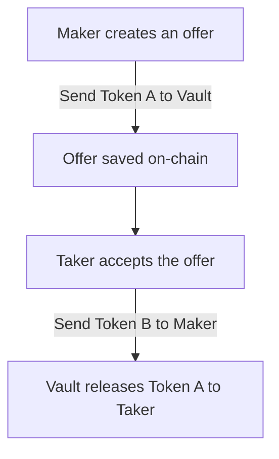

<div id="top"></div>

<br />
<div align="center">
  <h3 align="center">Solana Swap Smart Contract</h3>

  <p align="center">
    🚀 A decentralized swap program built on the Solana blockchain using Anchor.
    <br />
    <a href="https://github.com/username/solana-swap/issues">Report Bug</a>
    ·
    <a href="https://github.com/username/solana-swap/issues">Request Feature</a>
  </p>
</div>

## 🔰 About The Project

This project demonstrates a swap mechanism on the Solana blockchain using an Anchor-based smart contract. Users can create and fulfill swap offers between two tokens. The contract provides methods to make and take swap offers securely by utilizing Solana's token program and on-chain accounts.

<p align="right">(<a href="#top">back to top</a>)</p>

### 🛠 Built With

* [Solana](https://solana.com/)
* [Anchor Framework](https://project-serum.github.io/anchor/)
* [Rust](https://www.rust-lang.org/)

<p align="right">(<a href="#top">back to top</a>)</p>

## 🚀 Getting Started

To get a local copy up and running, follow these steps.

### Prerequisites

* Install Solana CLI:
  ```sh
  sh -c "$(curl -sSfL https://release.solana.com/stable/install)"
  ```
* Install Anchor Framework:
  ```sh
  cargo install --git https://github.com/coral-xyz/anchor avm --locked --force
  avm install latest
  avm use latest
  ```
* Ensure Rust is installed:
  ```sh
  curl --proto '=https' --tlsv1.2 -sSf https://sh.rustup.rs | sh
  ```

### Installation

1. Clone the repository:
   ```sh
   git clone https://github.com/username/solana-swap.git
   ```
2. Navigate to the project directory:
   ```sh
   cd solana-swap
   ```
3. Build the smart contract:
   ```sh
   anchor build
   ```
4. Deploy the program to the Solana devnet:
   ```sh
   anchor deploy
   ```

<p align="right">(<a href="#top">back to top</a>)</p>

## 🔃 Usage

The Solana Swap smart contract provides two main methods:

1. `make_offer`: Creates a swap offer by specifying the amount of token A being offered and the amount of token B wanted.
   ```rust
   pub fn make_offer(
       context: Context<MakeOffer>,
       id: u64,
       token_a_offered_amount: u64,
       token_b_wanted_amount: u64,
   ) -> Result<()>
   ```

2. `take_offer`: Accepts an existing swap offer by transferring the requested token B to the maker and withdrawing token A from the vault.
   ```rust
   pub fn take_offer(context: Context<TakeOffer>) -> Result<()>
   ```

For detailed examples, please refer to the [Documentation](https://github.com/username/solana-swap).

<p align="right">(<a href="#top">back to top</a>)</p>

## 🔠 Swap Workflow Diagram

Below is a high-level diagram explaining the swap mechanism:



<p align="right">(<a href="#top">back to top</a>)</p>

## 🛏️ Roadmap

- [x] Implement basic swap functionality
- [x] Deploy contract to Solana devnet
- [ ] Add comprehensive unit tests
- [ ] Integrate front-end application for user interaction
- [ ] Audit smart contract for security

See the [open issues](https://github.com/username/solana-swap/issues) for a full list of proposed features and known issues.

<p align="right">(<a href="#top">back to top</a>)</p>

## 💡 Contributing

Contributions are what make the open-source community amazing! Follow these steps to contribute:

1. Fork the Project
2. Create your Feature Branch (`git checkout -b feature/AmazingFeature`)
3. Commit your Changes (`git commit -m 'Add some AmazingFeature'`)
4. Push to the Branch (`git push origin feature/AmazingFeature`)
5. Open a Pull Request

<p align="right">(<a href="#top">back to top</a>)</p>

## 📝 License

Distributed under the MIT License. See `LICENSE` for more information.

<p align="right">(<a href="#top">back to top</a>)</p>

## 📧 Contact

Twitter - [@bgraokmush](https://twitter.com/bgraokmush)

<p align="right">(<a href="#top">back to top</a>)</p>

## 🙏 Acknowledgments

* [Anchor Documentation](https://project-serum.github.io/anchor/)
* [Solana Documentation](https://docs.solana.com/)
* [Rust Lang Book](https://doc.rust-lang.org/book/)

<p align="right">(<a href="#top">back to top</a>)</p>

